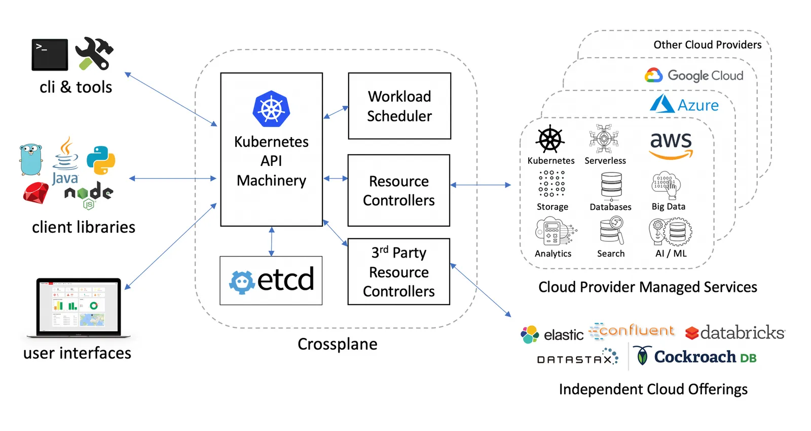
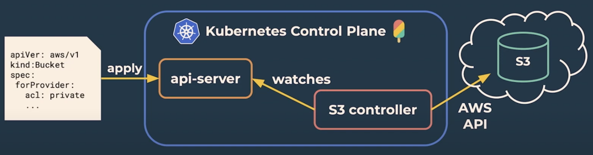
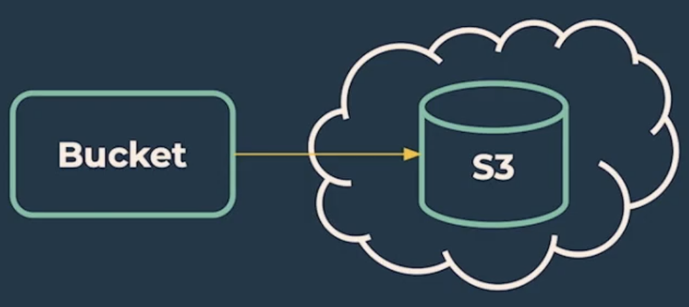

## What is crossplane ?

> Crossplane is a Kubernetes Extension that helps platform teams manage anything using CRDs and Controllers (Public Cloud and On-Prem).
> A Controlplane orchestrating other controlplanes.

 

## What are providers ?
Providers are operators (controllers) with remote API expertise. 
They Continually reconcile the desired state of the managed resources with the remote API.
<br>
 


## How can we install it ?

```bash
helm repo add crossplane-stable https://charts.crossplane.io/stable \
&& helm repo update \
&& helm install crossplane \
--namespace crossplane-system \
--create-namespace crossplane-stable/crossplane 
```{{exec}}

Verify the crossplane pods are running

```bash
kubectl get pods -n crossplane-system
```{{exec}}

Look at the new API end-points with 

```bash
kubectl api-resources | grep crossplane
```{{exec}}


## A quick example
Lets try creating an S3 bucket with crossplane
<br>


First, we need to install the S3 provider

```bash
cat <<EOF | kubectl apply -f -
apiVersion: pkg.crossplane.io/v1
kind: Provider
metadata:
  name: provider-aws-s3
spec:
  package: xpkg.upbound.io/upbound/provider-aws-s3:v1.1.0
EOF
```{{exec}}

verify the provider is running
```bash
watch kubectl get providers
```{{exec}}

Create a new secret with your aws credentials

```bash 
AWS_PROFILE=default && echo -e "[default]\naws_access_key_id = $(aws configure get aws_access_key_id --profile $AWS_PROFILE)\naws_secret_access_key = $(aws configure get aws_secret_access_key --profile $AWS_PROFILE)" > aws-creds.txt
```{{exec}}

```bash
kubectl create secret generic aws-creds -n crossplane-system --from-file=creds=./aws-creds.txt
```{{exec}}

And configure your provider to use the secret

```bash
cat <<EOF | kubectl apply -f -
apiVersion: aws.upbound.io/v1beta1
kind: ProviderConfig
metadata:
  name: default
spec:
  credentials:
    source: Secret
    secretRef:
      namespace: crossplane-system
      name: aws-creds 
      key: creds
EOF
```{{exec}}


```bash
cat <<EOF | kubectl create -f -
apiVersion: s3.aws.upbound.io/v1beta1
kind: Bucket
metadata:
  name: cnf-bucket
spec:
  forProvider:
    region: eu-central-1
  providerConfigRef:
    name: default
EOF
```{{exec}}

Verify the bucket creation

```bash
kubectl get buckets
```{{exec}}

```bash
kubectl get managed
```{{exec}}

```bash
crossplane beta trace bucket.s3.aws.upbound.io/cnf-bucket
```{{exec}}

```bash
aws s3 ls | grep cnf-bucket
```{{exec}}

```bash
kubectl describe bucket.s3.aws.upbound.io/cnf-bucket
```{{exec}}


## Destroy
```bash
kubectl delete bucket.s3.aws.upbound.io/cnf-bucket
```{{exec}}