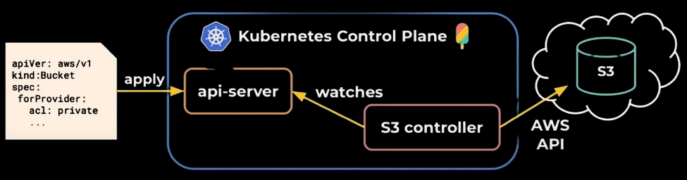

## What is crossplane ?

> Crossplane is a Kubernetes Extension that helps platform teams manage anything using CRDs and Controllers (Public Cloud and On-Prem).
> A Controlplane orchestrating other controlplanes.

 

## What are providers ?
Providers are operators (controllers) with remote API expertise. 
They Continually reconcile the desired state of the managed resources with the remote API.
<br>
 


## How can we install it ?

```bash
helm repo add crossplane-stable https://charts.crossplane.io/stable \
&& helm repo update \
&& helm install crossplane \
--namespace crossplane-system \
--create-namespace crossplane-stable/crossplane 
```{{exec}}

## A quick example
Lets try creating an S3 bucket with crossplane
<br>
