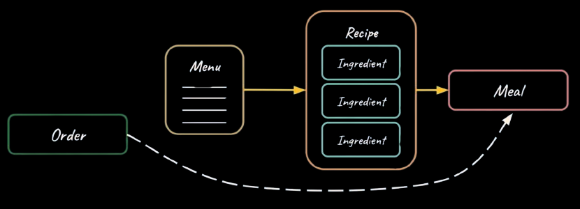
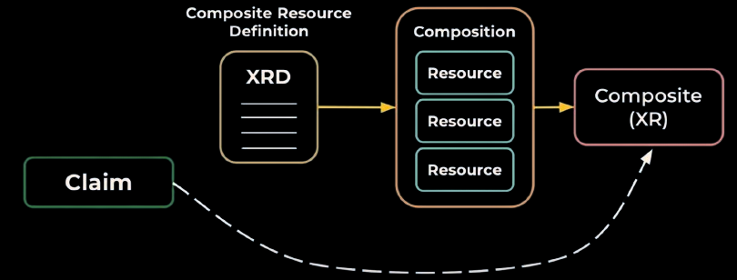
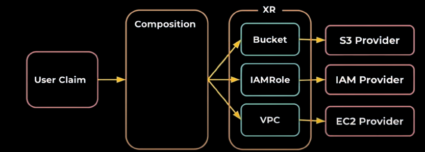

## Crossplane Compositions
> Using managed instances is not scalable. Crossplane compositions enable us to build complex infrastructure with simple interfaces. The simple interface is what platform engineers offer to end users.

### Restaurant Analogy
 

### Crossplane Compositions
 

### Compositions 1.0
 

 The providers start reconciling the managed resources as soon as they are persisted to the etcd.

## Example, AWS SQL Database

Lets see how a postgres database can be provisioned

Platform

```bash
kubectl apply -f 1.0/provider.yaml
```{{exec}}
```bash
kubectl apply -f 1.0/definition.yaml
```{{exec}}
```bash
kubectl apply -f 1.0/aws.yaml
```{{exec}}

Dev

```bash
kubectl apply -f 1.0/claim.yaml
```{{exec}}

Verify the creation of the composition resources
```bash
crossplane beta trace sqlclaim.cnf.com/my-db
```{{exec}}

```bash
kubectl get managed
```{{exec}}

## Destroy
```bash
kubectl delete -f 1.0/claim.yaml
```