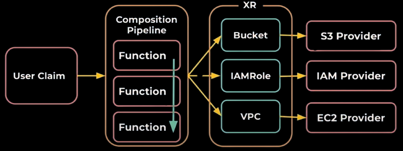
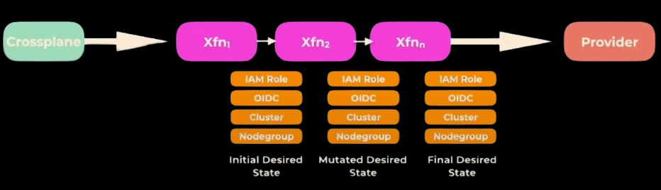
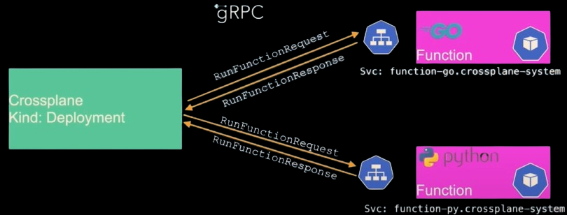

## Compositions 2.0
>  Defining composition resources in an array makes the configuration management a tedious task, especially if the composition consists of many resources. There will be too much yaml to handle. 

> Lack of programming constructs (loops and conditionals) is another limitation of staticly defined compositions.

Starting from version `1.11`, crossplane introduced the `v1alpha1` version of the composition functions. With version `1.14` the functions api is versioned at `v1beta1`.
### Functions Goals
The crossplane team aims to achive these goals with functions

* NOT to build a domain specific language (DSL) in yaml
* Support complex logic
* Support for any programming language (or use any text-processing tool)
* Ease of development, sharing and running
* Enable Multi-step pipelines
* More flexible release cycles as a result of separation of functions from crossplane core

### Compositions Pipeline
 
<br>
<br>

<br>
<br>


```go
message RunFunctionRequest {
    RequestMeta meta = 1;
    State observed = 2;
    State desired = 3;
    optional google.protobuf.Struct input = 4;
}
```

### Example of mutating desired state
```bash
cat 2.0/text.json | jq '.desired.composite.resource.labels |= {"cnf": "rocks"} + .'
```{{exec}}

### Example, AWS SQL Database

Let's see the revised version of the pervious composition

```bash
cat 2.0/aws.yaml
```{{exec}}