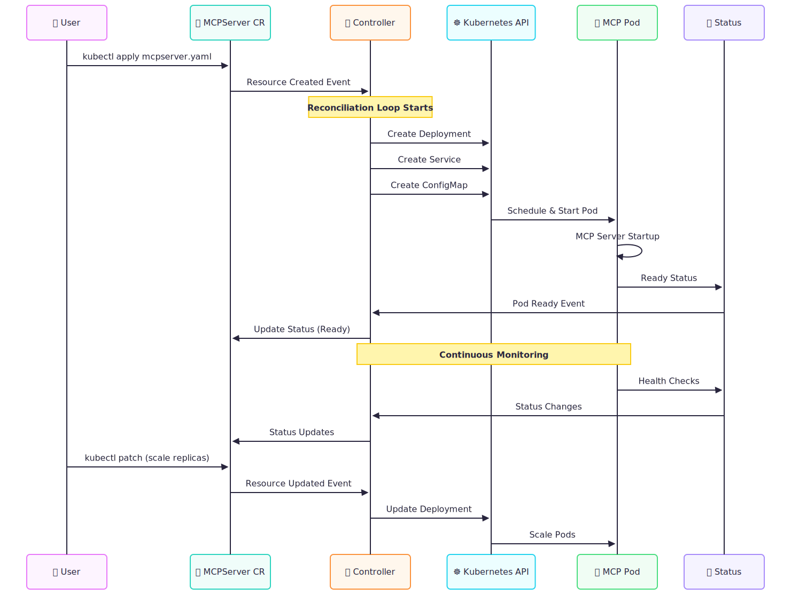

# Step 8: Operator Architecture Design

Now let's design the complete architecture for our MCPServer operator. We'll define how all components work together to create a production-ready, scalable MCP server management platform.

## Overall Architecture Overview

## Component Interaction Model

## Operator Control Loop

Let's implement key operator design patterns:

In the next step, we'll implement the complete MCPServer controller using this architecture!